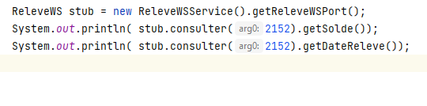
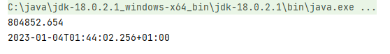

<html lang="en">
<head>
    <meta charset="UTF-8">
    <meta http-equiv="X-UA-Compatible" content="IE=edge">
    <meta name="viewport" content="width=device-width, initial-scale=1.0">
    <title>Client soap</title>
</head>
<body>
     <h1>Appel au methodes WebService a travers le stub: </h1>
    
    <h1>Reponse  renvoye le du stub</h1>
    
</body>
</html>